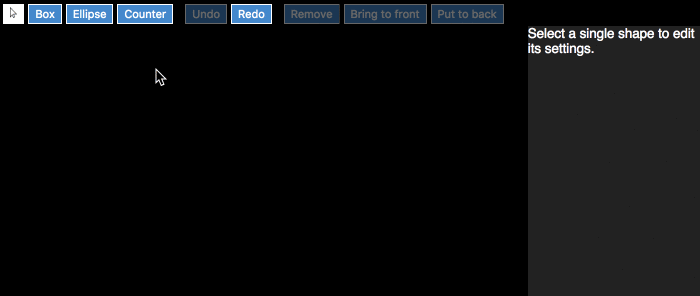

# baltar
Example graphics editor using MobX



To play with it, you will need:

* a browser (Chrome, Safari, Edge, Firefox)
* [Git](https://git-scm.com/downloads)
* [Node.js](https://nodejs.org/)

In a Terminal (Mac/Linux) or Command line (Windows):

```bash
git clone https://github.com/danielearwicker/baltar.git
cd baltar
npm install
node fuse.js
```

Then go to [localhost:4444](http://localhost:4444) in your browser .

To read the code, start at [src/index.tsx](https://github.com/danielearwicker/baltar/blob/master/src/index.tsx) and work your way down the JSX rendering.

We create an `EditorModel`, load any previous state into it from `localStorage`, wire it up to the `Undo` system, and then render the `Editor`.

The `Editor` consists of:

* `Toolbar` - this gets passed the `Undo` system so it can send commands to it 
* `PropertyPalette` - the pane on the right where shape settings appear
* `Paper` - the drawing surface

Persistent data is in properties marked with `@json` - see [json-mobx](https://github.com/danielearwicker/json-mobx), which also takes care of `Undo`.

Also of note is [src/geometry/Coordinate.ts](https://github.com/danielearwicker/baltar/blob/master/src/geometry/Coordinate.ts) which demonstrates the principle of view state being separate from model state. Every coordinate in the system has a `live` value being immediately manipulated and seen by the user, and a `committed` value that is known to the persistence system. The `commit` method copies one to the other. So during a drag operation, the `live` value is being edited. When it ends, the changes are committed. (This is very similar to validation.)

The drawing tools `Box`, `Ellipse` and `Counter` are instances of `ShapeContent`, defined in [src/factory.ts](https://github.com/danielearwicker/baltar/blob/master/src/factory.ts). 

The `Counter` is interesting in that it demonstrates "liveness":

```ts
export class Counter extends Rectangular {

    @observable count = 0;

    timer: any;

    constructor() {
        super();
        this.timer = setInterval(() => this.count++, 1000);
    }

    dispose() {
        clearInterval(this.timer);
    }

    get content() {
        const { l, b } = this.rect.normalized;
        return <text fill="magenta" fontSize="5em" x={l} y={b}>{this.count+""}</text>
    }
}
```

 Draw a counter on the page and then move it around a few times. Then click `Undo` and `Redo`. The counter does not reset, because the object is not being recreated. Rather, the old persistent state (the position, managed here by the base class `Rectangular`) is being reconciled into the existing object, just as React reconciles Virtual DOM elements into existing real DOM elements.

If you `Undo` back past the point where the counter was created, it will disappear and be disposed. Its internal timer will be cleared. If you then `Redo` to make it reappear, now the counter will have reset.

